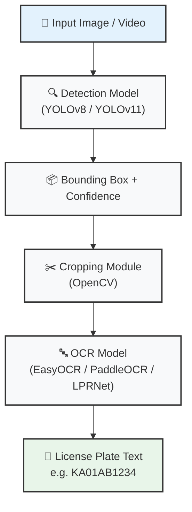
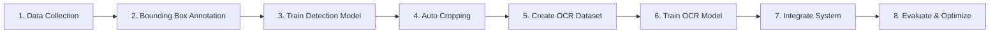
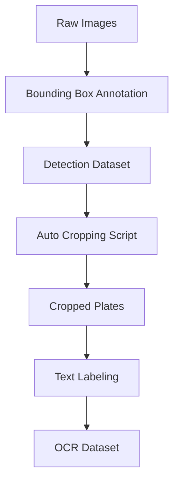
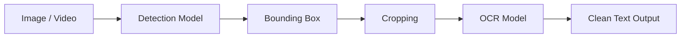
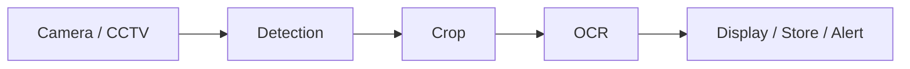

```markdown
# 🚗 Indian License Plate Recognition (LPR) System


---

## 📌 Overview

This project aims to build a complete **License Plate Recognition (LPR)** system for Indian vehicles using a **2-stage deep learning pipeline**:

1. **Detection Model** → Finds license plates in images  
2. **OCR Model** → Reads text from detected plates  

---

## 🧠 System Architecture



---

## 🔁 End-to-End Pipeline



---

## 📦 Dataset Strategy

### 🔹 Detection Dataset
- **Input**: Full vehicle images  
- **Annotation**: Bounding boxes (YOLO format)

```yaml
class x_center y_center width height
```

### 🔹 OCR Dataset
- **Input**: Cropped plates  
- **Annotation**: Text only

**Example**: `img_001.jpg` → `KA01AB1234`

### 🔁 Data Flow



---

## ✏️ Annotation Guidelines

### ✅ Detection Rules
- Tight bounding boxes only  
- Include entire plate  
- Avoid background noise  

### 🔤 OCR Rules
- Exact text (no guessing)  
- Maintain Indian format (KA01AB1234, DL7C1234, etc.)  

### ❌ Common Mistakes to Avoid
- Loose boxes  
- Cut-off characters  
- Confusing O/0, I/1, B/8  

### 🏷️ Optional Attributes
```text
blur: yes/no
tilted: yes/no
occluded: yes/no
night: yes/no
```

---

## 👥 Team Workflow
- **Team A** → Bounding Box Annotation  
- **Team B** → Quality Check  
- **Team C** → Cropping + OCR Labeling  
- **Team D** → Final Validation  

---

## ⚙️ Detection Model
**Recommended**: YOLOv8 / YOLOv11  
**Metrics**: mAP@0.5, mAP@0.5:0.95

---

## ✂️ Cropping Module
Simple OpenCV script (not a model).

---

## 🔤 OCR Model
**Recommended Options**:
- EasyOCR (quick start)
- PaddleOCR (better for Indian fonts)
- LPRNet / CRNN (custom trained)

**Metrics**: Character Accuracy + Full Plate Accuracy

---

## 🔁 Integration Pipeline



### 🎥 Real-Time Pipeline



---

## ⚠️ Challenges & Improvements

**Main Challenges**:
- Small/distant plates
- Dirty, reflective, multi-line plates
- Similar characters (0/O, 1/I, etc.)

**Improvements**:
- Heavy data augmentation
- Perspective correction
- End-to-end model (future)

---

## 🔐 Legal Considerations
- License plates contain sensitive data  
- **Never** publicly share raw dataset  
- Use IDD dataset or synthetic data for sharing

---

## 📁 Project Structure

```bash
indian-lpr/
├── data/
│   ├── raw_images/
│   ├── detection_labels/
│   ├── cropped_plates/
│   └── ocr_labels/
├── models/
│   ├── detector.py
│   └── ocr.py
├── scripts/
│   ├── crop_from_detections.py
│   └── inference.py
├── inference/
│   └── main.py
├── config.yaml
├── requirements.txt
└── README.md
```

---

## 🔥 Key Takeaways
- Detection = bounding boxes only  
- OCR = text only  
- Cropping = simple script (NOT a model)  
- Good data > complex models

---

## 🚀 Execution Plan

**Phase 1**: Data Collection & Annotation  
**Phase 2**: Train Detection Model  
**Phase 3**: Create OCR Dataset (auto-crop)  
**Phase 4**: Train OCR Model  
**Phase 5**: Full Pipeline Integration  
**Phase 6**: Optimization & Real-time Testing

---

## 📊 Future Scope
- Real-time CCTV deployment
- Edge device (Jetson/Raspberry Pi)
- Web API + Dashboard
- Traffic violation integration

---

## 📌 Conclusion

This is a **complete production-ready ML system**, not just a model.

> “Good data beats complex models.”

---

## 🤝 Contribution
- Follow annotation guidelines strictly
- Keep consistency across the team
- Report unclear images
